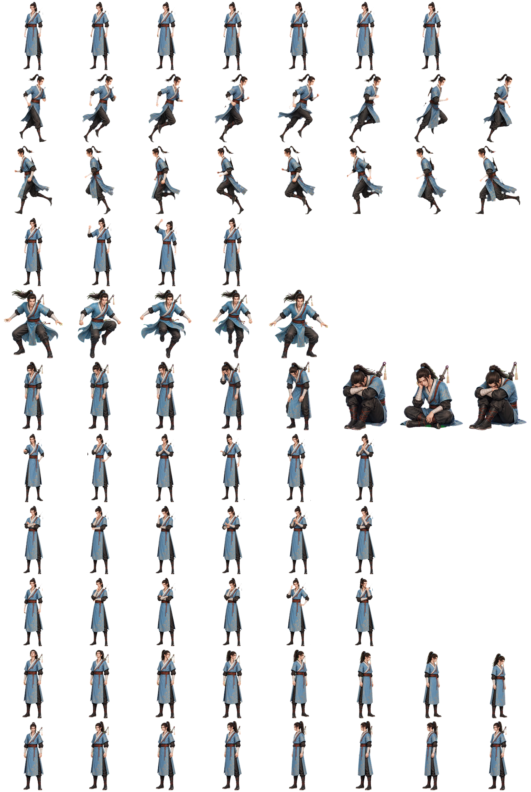
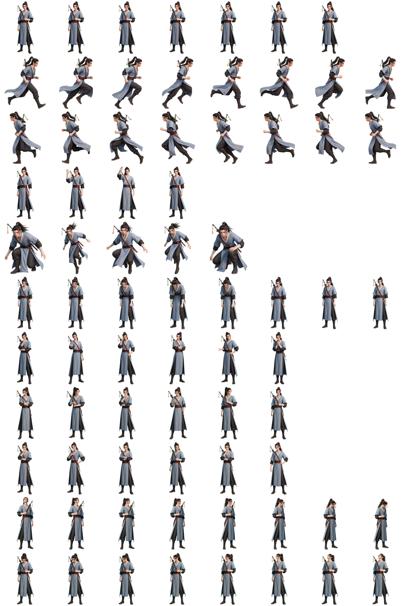

# AI 宠物素材库

> 把一个角色，变成会动的 Codex AI 宠物。

面向用户和创作者的动画宠物资源库：提供可直接迁移的 v2 精灵图集、标准动画状态、视线方向、宠物描述和完整校验记录。仓库同时保留角色参考素材与生成适配工具，方便在另一台 Codex 上继续制作、修复或扩展。

**语言 / Language：** 中文（当前） · [English](README.en.md)

## 为什么值得使用

- **拿来即用**：两套已经通过 v2 校验的完整宠物包，不必从零组装图集。
- **动作齐全**：9 个标准动画状态，覆盖待机、移动、挥手、跳跃、失败、等待和审核等常见场景。
- **方向完整**：额外提供 16 个顺时针视线方向，让宠物在交互中更有存在感。
- **交付友好**：同时提供 WebP（体积更小）和 PNG（无损编辑），并附带 JSON 描述、清单和校验结果。
- **方便迁移**：最终包集中在 `release/pets/`，换机器时不依赖本地生成中间文件。

## 宠物预览

<table>
  <tr>
    <td align="center"><strong>青岚·原比例</strong><br></td>
    <td align="center"><strong>吕洞宾</strong><br></td>
  </tr>
</table>

| 宠物 | 角色定位 | 资源包 | 校验 |
| --- | --- | --- | --- |
| **青岚·原比例** (`qinglan-original`) | 蓝衣古风剑客，成人比例、束发、背剑 | [打开资源包](release/pets/qinglan-original/) | `ok: true` |
| **吕洞宾** (`baxian-lvdongbin`) | 青蓝长袍、背剑的古风剑客 | [打开资源包](release/pets/baxian-lvdongbin/) | `ok: true` |

## 5 分钟开始使用

```bash
git clone https://github.com/kingdoja/ai-pet.git
cd ai-pet
```

在 `release/pets/<pet-id>/` 中选择一个宠物：

- 运行时优先使用 `spritesheet-extended.webp`；
- 需要无损编辑或重新导出时使用 `spritesheet-extended.png`；
- 读取 `pet_request.json` 或 `manifest.json` 获取图集尺寸、动画行和文件信息。

## 资源规格

每套图集均符合 Codex v2 宠物资源约定：

- **图集尺寸**：1536 × 2288 px；8 列 × 11 行；单格 192 × 208 px；
- **动画状态**：`idle`、`running-right`、`running-left`、`waving`、`jumping`、`failed`、`waiting`、`running`、`review`；
- **视线方向**：16 个顺时针方向（`000`–`337.5`，位于第 10、11 行）；
- **格式**：RGBA 透明背景，已清理透明像素中的 RGB 残留；
- **版本**：`sprite_version_number: 2`。

## 目录结构

```text
.
├── release/pets/                 # 可发布、可迁移的最终宠物包
│   ├── qinglan-original/
│   └── baxian-lvdongbin/
├── 角色素材/                     # 角色参考图与公开素材
├── 角色设定/                     # 角色设定图与视频
├── tools/imagegen_url_adapter/   # 图像生成 URL 适配工具
├── .env.example                  # 本地生成所需环境变量示例
├── README.md                     # 中文说明
└── README.en.md                  # English documentation
```

`output/` 和 `tmp/` 是生成过程中的逐帧文件、QA 草稿和临时提示词，默认加入 `.gitignore`，不会影响最终资源迁移。

## 迁移到另一台 Codex

1. 克隆仓库并打开项目目录。
2. 直接从 `release/pets/` 取用最终图集。
3. 如需继续生成或修复，复制 `.env.example` 为本机 `.env`，填入新的 API Key，再使用 `角色素材/` 和 `角色设定/` 作为参考。
4. `output/`、`tmp/` 等中间目录可以在新环境中重新生成，不需要从旧机器搬运。

> 请勿把真实 API Key 写入仓库。私有仓库的访问权限也需要在新机器上重新登录 GitHub。

## 本地检查

快速查看两套资源的校验摘要：

```bash
for f in release/pets/*/validation-*.json; do
  jq '{ok, sprite_version_number, columns, rows, width, height, errors, warnings}' "$f"
done
```

预期结果为 `ok: true`、`sprite_version_number: 2`、`columns: 8`、`rows: 11`。

## 素材与使用说明

`角色素材/` 中部分图片来自用户提供的参考或片方公开发布素材，仅用于角色外观研究和本地生成流程。发布或再分发前，请确认相应版权、肖像/角色授权和平台使用条款；不要把参考图中的水印、字幕、片名或宣传文案带入宠物图集。

## 项目状态

当前版本已固化两套可迁移的 v2 宠物包、参考素材、生成适配工具和校验记录。欢迎基于现有包继续制作新的角色或动画变体。
